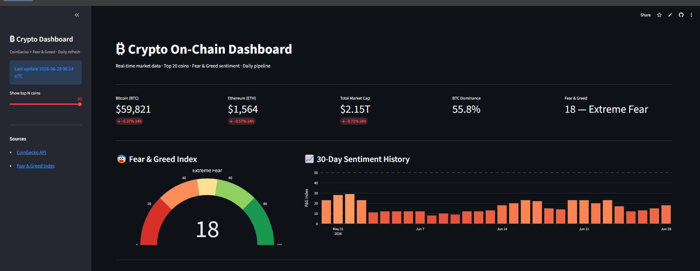
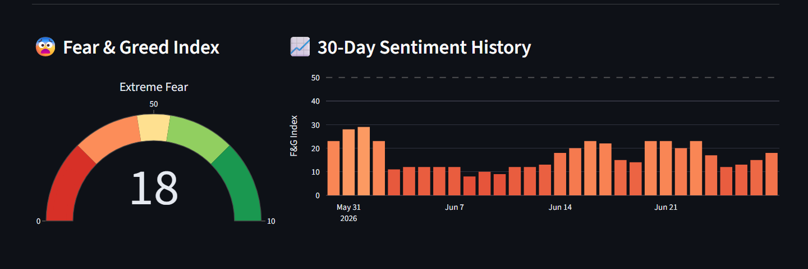
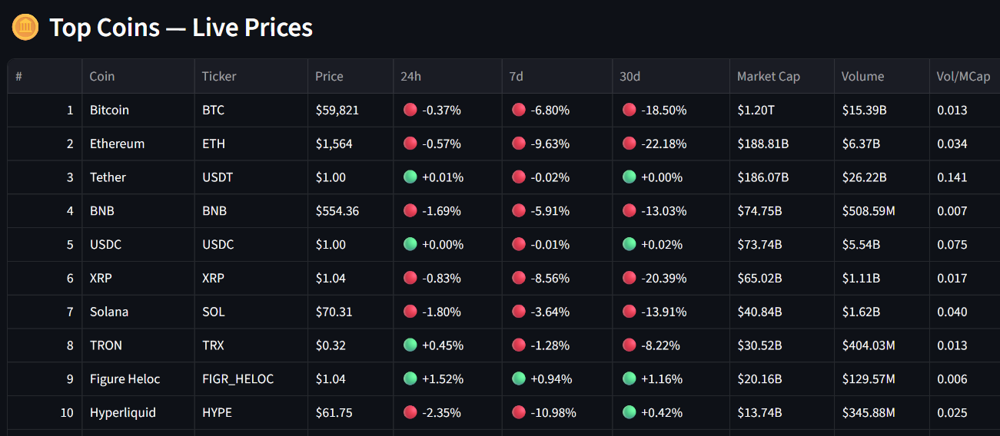
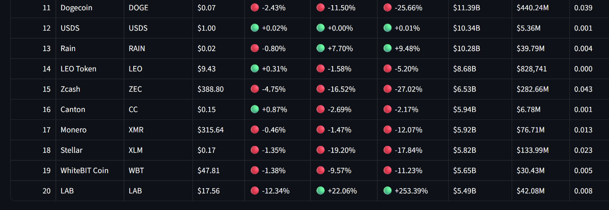
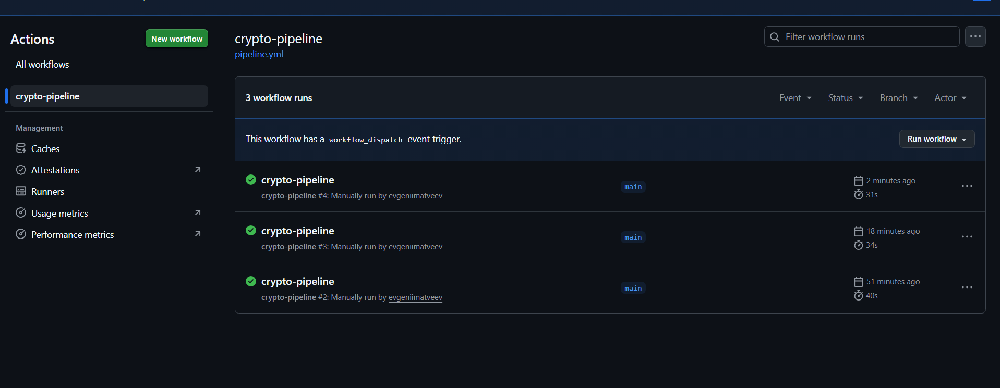
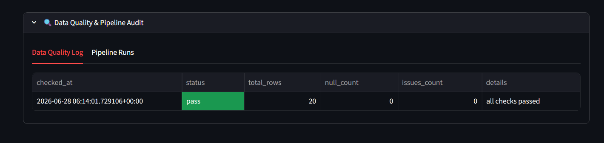
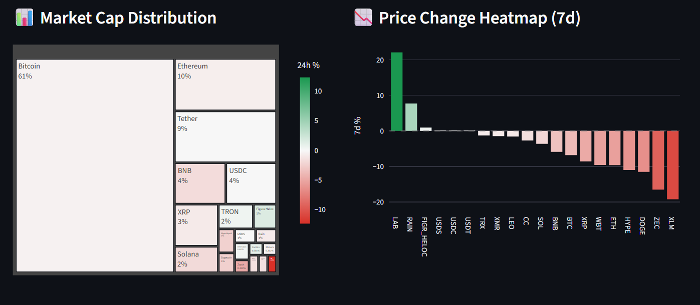
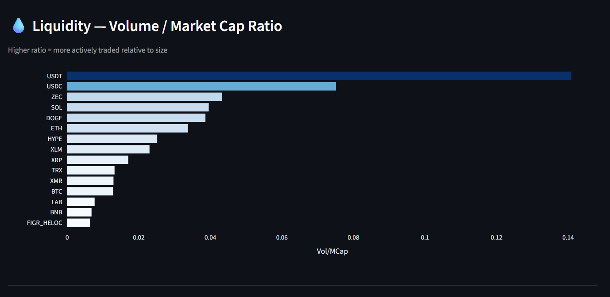

# ₿ Crypto On-Chain Dashboard

Real-time cryptocurrency market intelligence — Top 20 coins · Fear & Greed sentiment · Daily pipeline · Live on Streamlit Cloud.

**[Live Demo →](https://crypto-onchain-dashboard.streamlit.app)**

---



---

## What's inside

**20 coins tracked** · **$2.15T total market cap** · **Fear & Greed: 18 (Extreme Fear)** · refreshed daily via GitHub Actions.

Every metric pulled live from CoinGecko and the Alternative.me Fear & Greed API — no API keys required, no paid tier.

### Dashboard sections

| Section | What it shows |
|---|---|
| KPI Cards | BTC · ETH · Total Market Cap · BTC Dominance · Fear & Greed |
| Fear & Greed Gauge | Semicircular gauge — current sentiment in one glance |
| 30-Day Sentiment | Daily bar chart colored red→green — spot the fear cycles |
| Top 20 Coins Table | Price · 24h/7d/30d changes · Market Cap · Volume · Vol/MCap ratio |
| Market Cap Treemap | BTC 61% · ETH 10% · Tether 9% — visual size comparison |
| Price Heatmap (7d) | Ranked bar chart — who's pumping, who's bleeding |
| Liquidity Ratio | Vol/MCap sorted — USDT and USDC dominate by turnover |
| Pipeline Audit | Data quality log + pipeline run history (expandable) |

---



---

## Architecture

```
┌──────────────────────────── GitHub Actions (daily 12:00 UTC) ─────────────────────────────┐
│                                                                                            │
│   CoinGecko /coins/markets ──┐                                                            │
│   CoinGecko /global ─────────┼──► httpx (3× retry + backoff) ──► pandas transform        │
│   Alternative.me F&G ────────┘                                          │                 │
│                                                                          ▼                 │
│                                                              DuckDB  (crypto.duckdb)       │
│                                                       ┌──────────────────────────┐         │
│                                                       │  crypto_prices           │         │
│                                                       │  market_summary          │         │
│                                                       │  fear_greed              │         │
│                                                       │  data_quality_log        │         │
│                                                       │  pipeline_runs           │         │
│                                                       └────────────┬─────────────┘         │
│                                                                    │                       │
│                                               HuggingFace Dataset  (binary upload)        │
└────────────────────────────────────────────────────────────────────────────────────────────┘
                                                                    │
                                           Streamlit Cloud  (hf_hub_download on cold start)
                                                                    │
                                    ┌───────────────────────────────▼──────────────────────┐
                                    │  7-section dashboard                                  │
                                    │  KPI row · F&G gauge · 30-day sentiment               │
                                    │  Top 20 table · Treemap · 7d Heatmap                  │
                                    │  Liquidity chart · Pipeline audit                     │
                                    └──────────────────────────────────────────────────────┘
```

---

## Tech stack

```
CoinGecko API (free, no key)   →  Top 20 coins by market cap
Alternative.me F&G API         →  30-day Fear & Greed history
        ↓
    Python + httpx              →  3-retry extract with backoff
    pandas                      →  transform + deduplication
    DuckDB 1.5.4                →  5-table analytical store
        ↓
    HuggingFace Dataset         →  binary DB storage (crypto.duckdb)
    GitHub Actions              →  daily pipeline at 12:00 UTC
        ↓
    Streamlit + Plotly          →  7-section interactive dashboard
    Streamlit Cloud             →  live deployment
```

---





---

## Pipeline

GitHub Actions runs daily at 12:00 UTC: download DB → extract → validate → load → upload.

Each run writes a Job Summary with status, coins fetched, null count, and duration.



QA thresholds: `pass` ≥ 20 coins · `warn` < 20 · `fail` < 10. Every run logged to `data_quality_log` table inside DuckDB.



---



---



---

## DuckDB tables (5)

| Table | Contents |
|---|---|
| `crypto_prices` | One row per coin per run — price, volume, dominance, 7d/30d change |
| `market_summary` | Global metrics — total market cap, BTC/ETH dominance, market cap change |
| `fear_greed` | Daily Fear & Greed index — value, classification, timestamp |
| `data_quality_log` | QA result per run — status, null count, issues |
| `pipeline_runs` | Audit log — run_id, duration, coins fetched, rows inserted |

---

## Run locally

```bash
git clone https://github.com/evgeniimatveev/crypto-dashboard
cd crypto-dashboard
python -m venv .venv && .venv\Scripts\activate
pip install -r requirements.txt
python run_pipeline.py
streamlit run dashboard/app.py
```

No API keys needed. On first run `_ensure_db()` downloads the latest DB from HuggingFace automatically.

---

## Key findings (June 2026)

- **Extreme Fear persists** — F&G index held below 20 for most of June, signaling sustained risk-off sentiment
- **BTC dominance at 55.8%** — altcoins losing ground relative to Bitcoin
- **USDT leads liquidity** — Vol/MCap ratio 0.141, nearly 3× higher than USDC — stablecoin flight confirmed
- **ETH down 22% in 30 days** — underperforming BTC (-18.5%) in the same window
- **LAB token +253% in 30d** — outlier in an otherwise bearish market

---

*Data: [CoinGecko](https://www.coingecko.com/en/api) · [Fear & Greed Index](https://alternative.me/crypto/fear-and-greed-index/) · Refreshed daily via GitHub Actions*
